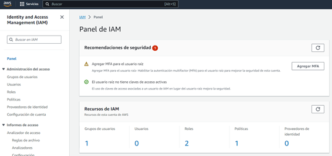
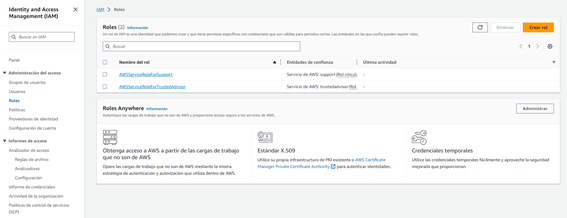
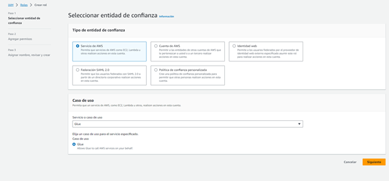

# ETL_AWS

Proceso ETL (Extract, Transform, Load), el cual implica la carga de un archivo CSV en un bucket de Amazon S3 , mediante el servicio Glue de AWS, se lleva a cabo la transformación para posteriormente cargarlo o consultar su contenido a través de una base de datos en Amazon Athena.

### Paso 1

**IAM – Roles**

- Para crear un rol, debemos dirigirnos al panel del servicio Identity and Access Management (IAM) e ingresar a la opción de "Roles".

 

- Presionamos la opción de "Crear Rol" y luego seleccionamos "Servicio de AWS". Además, en el apartado de "Servicios de caso de uso", agregamos el servicio "Glue" y presionamos el botón siguiente.

 

