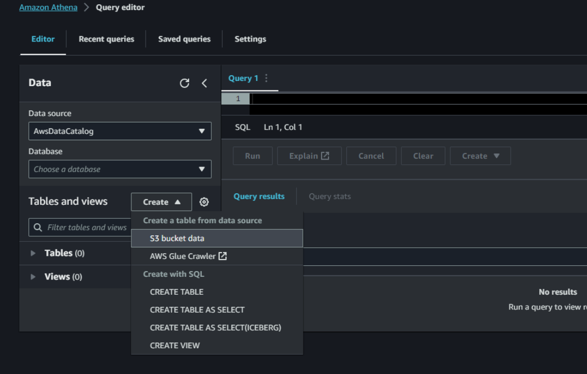

# ETL_AWS

<br>

| TABLA DE CONTENIDO     |
| ------------ |
| [Introducción](#Introducción) |
| [Paso 1](#Paso-1) |
| [Paso 2](#Paso-2) |
| [Paso 3](#Paso-3) |
| [Paso 4](#Paso-4) |

<br>

### Introduccion
Proceso ETL (Extract, Transform, Load), el cual implica la carga de un archivo CSV en un bucket de Amazon S3 , mediante el servicio Glue de AWS, se lleva a cabo la transformación para posteriormente cargarlo o consultar su contenido a través de una base de datos en Amazon Athena.

<br>

### Paso 1
-----------

<br>

**IAM – Roles**

<br>

- Para crear un rol, debemos dirigirnos al panel del servicio Identity and Access Management (IAM) e ingresar a la opción de "Roles".

<br>


<br>

- Presionamos la opción de "Crear Rol" y luego seleccionamos "Servicio de AWS". Además, en el apartado de "Servicios de caso de uso", agregamos el servicio "Glue" y presionamos el botón siguiente.

<br>

 

<br>

- En el apartado de "Agregar permisos", otorgamos el permiso de "Amazon S3 Full Access" y continuamos.

<br>


<br>

- En el apartado de "Asignar nombre, revisar y crear", asignamos un nombre al rol que estamos creando, en este caso, "aws_rol", y hacemos clic en "Crear".
  
<br>


<br>

- Para verificar si el rol creado se ha guardado correctamente, puedes dirigirte a la sección de "Roles".
  
<br>


<br>

[Volver inicio :arrow_up:](#ETL_AWS)

<br>

### Paso 2
-----------

<br>

**Crear Bucket**

<br>

- Para crear un bucket nos dirigimos al servicio de Amazon S3 de AWS y luego vamos a la opción de *"Buckets"*.

<br>


<br>

- Presionamos en "Crear Bucket", y luego debemos asignar un nombre único al bucket, en este caso, "bucket-aws-1", y procedemos a crearlo.

<br>


<br>

- Después, nos dirigimos al bucket creado para crear carpetas que se utilizarán en este ejemplo.
Creamos 4 carpetas llamadas: "csv_input" (donde colocaremos el archivo CSV que vamos a transformar), "csv_output" (donde se guardará el archivo de salida después de la transformación en el servicio Glue), "script", y "temp".

<br>


<br>

- Carpeta de "csv_input", con el CSV que utilizaremos:

<br>


<br>

[Volver inicio :arrow_up:](#ETL_AWS)

<br>

### Paso 3
-----------

<br>

**AWS Glue**

<br>

- Ingresamos al servicio "AWS Glue" y accedemos a la opción de "ETL visual" para crear un job.

<br>


<br>

- En esta sección, seleccionamos los recursos que utilizaremos. En "Data Source" seleccionamos 
Amazon S3, luego en "Transform" optamos por "Change Schema", y finalmente, en "Target", 
seleccionamos nuevamente Amazon S3

<br>


<br>

- En "Data Source" de Amazon S3, configuramos la ubicación de nuestro archivo CSV en "S3 
URL", definimos el formato de datos como CSV y establecemos el delimitador como ";".

<br>


<br>

- "Change Schema",nos permite visualizar las columnas de nuestro archivo CSV y modificar nombres o tipos de variables si es 
necesario, ademas de permitirnos eliminar columnas.

<br>


<br>

- En el apartado de "Target" de Amazon S3, cambiamos el tipo de archivo a CSV y especificamos 
la ruta de salida de la transformación en la carpeta "csv_output".

<br>


<br>

- En la sección de "Script", se genera el código en Python correspondiente al proceso que 
estamos realizando.

<br>


<br>

**codigo python**

<br>

```cmd
import sys
from awsglue.transforms import *
from awsglue.utils import getResolvedOptions
from pyspark.context import SparkContext
from awsglue.context import GlueContext
from awsglue.job import Job
args = getResolvedOptions(sys.argv, ["JOB_NAME"])
sc = SparkContext()
glueContext = GlueContext(sc)
spark = glueContext.spark_session
job = Job(glueContext)
job.init(args["JOB_NAME"], args)
# Script generated for node Amazon S3
AmazonS3_node163956 = glueContext.create_dynamic_frame.from_options(
 format_options={"quoteChar": '"', "withHeader": True, "separator": ";"},
 connection_type="s3",
 format="csv",
 connection_options={
 "paths": ["s3://bucket-aws-1/csv_input/Data.csv"],
 "recurse": True,
 },
 transformation_ctx="AmazonS3_node163956",
)
# Script generated for node Change Schema
ChangeSchema_node163956 = ApplyMapping.apply(
 frame=AmazonS3_node163956,
 mappings=[
 ("ID_cliente", "string", "ID_cliente", "string"),
 ("Cliente", "string", "Cliente", "string"),
 ("Fecha_solicitud", "string", "Fecha_solicitud", "string"),
 ("monto", "string", "monto", "string"),
 ("cuota", "string", "cuota", "string"),
 ],
 transformation_ctx="ChangeSchema_node163956",
)
# Script generated for node Amazon S3
AmazonS3_node163956 = glueContext.write_dynamic_frame.from_options(
 frame=ChangeSchema_node163956,
 connection_type="s3",
 format="csv",
 connection_options={
 "path": "s3://bucket-aws-1/csv_output/",
 "compression": "snappy",
 "partitionKeys": [],
 },
 transformation_ctx="AmazonS3_node163956",
)
job.commit()

```

<br>

Luego, nos dirigimos a la sección de "Job Details" para configurar el job en AWS Glue, donde 
realizamos las siguientes modificaciones:
- En "Name", asignamos un nombre a la tarea, como por ejemplo, "job_aws".
- En "IAM Role", asociamos el rol que creamos previamente, denominado "aws_rol".
- En "Requested Number of Workers", utilizamos 3 trabajadores, ya que nuestro archivo CSV es 
pequeño y no es necesario aumentar el tiempo de transformación.
- En "Script Path", especificamos la ruta de la carpeta "script" ubicada en nuestro bucket.
- En "Temporary Path", indicamos la carpeta "temp" que creamos en nuestro bucket.
- Guardamos la configuración y ejecutamos el job.

<br>


<br>

- Nos dirigimos a la sección de "Job Run Monitoring" para verificar que el archivo se esté 
ejecutando correctamente.

<br>


<br>


[Volver inicio :arrow_up:](#ETL_AWS)

<br>

### Paso 4
-----------

<br>

**Amazon Athena**

<br>

- Nos dirigimos al servicio de Amazon Athena para insertar los datos transformados del CSV en una base de datos. Seleccionamos "Create" y "S3 Bucket Data".

<br>



<br>

